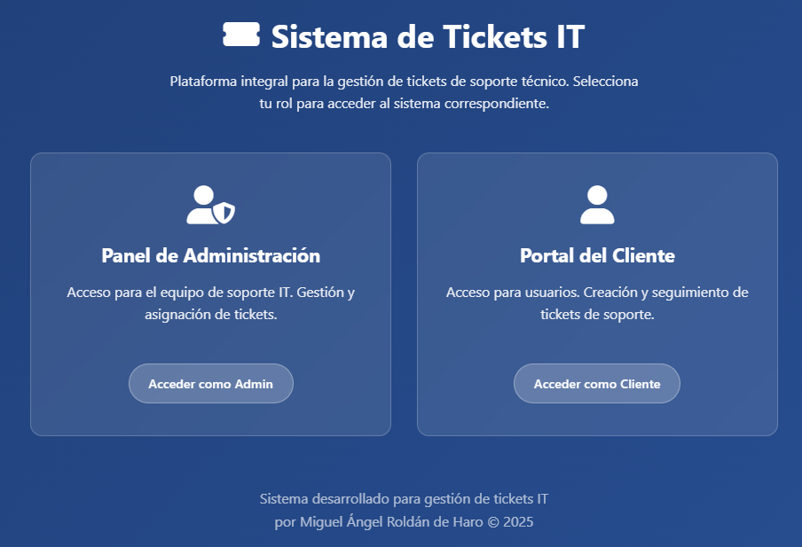
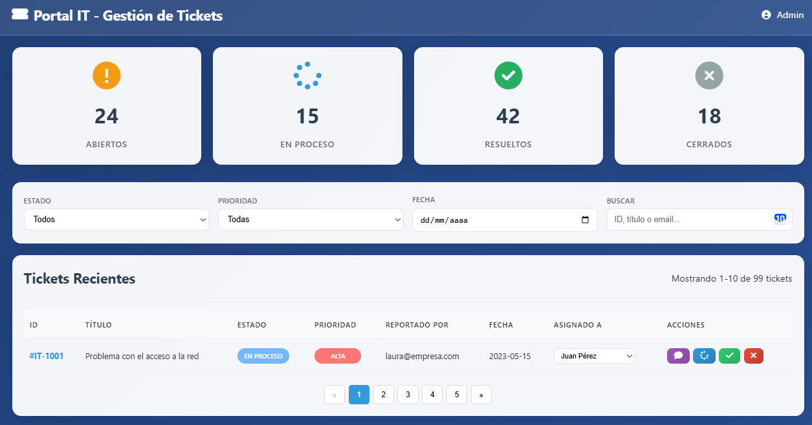
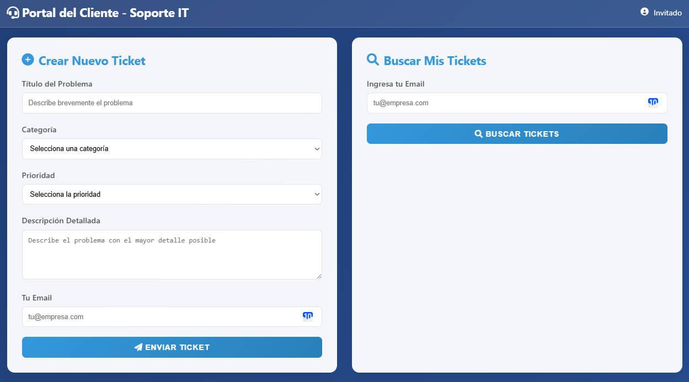

# Sistema de Tickets IT

Sistema completo para la gestión de tickets de soporte técnico, con interfaces separadas para administradores y clientes.

## 🌐 Demo en vivo

El proyecto está disponible en GitHub Pages:  
🔗 [Ver demo](https://mayky23.github.io/Ticket-Management/)

- **Página de Inicio**:
  - Acceso diferenciado para clientes y administradores (Creada unicamente para mostrar ambas opciones al público)

## 🚀 Características principales

- **Portal del Cliente**:
  - Creación de nuevos tickets
  - Seguimiento de tickets existentes
  - Interfaz simple e intuitiva

- **Panel de Administración**:
  - Gestión completa de tickets
  - Asignación a técnicos
  - Cambio de estados
  - Comentarios internos
  - Estadísticas y reporting

## 🖥️ Tecnologías utilizadas

- HTML5 semántico
- CSS3 moderno (Flexbox, Grid, variables CSS)
- JavaScript vanilla
- [Font Awesome](https://fontawesome.com/) para iconos
- GitHub Pages para hosting
